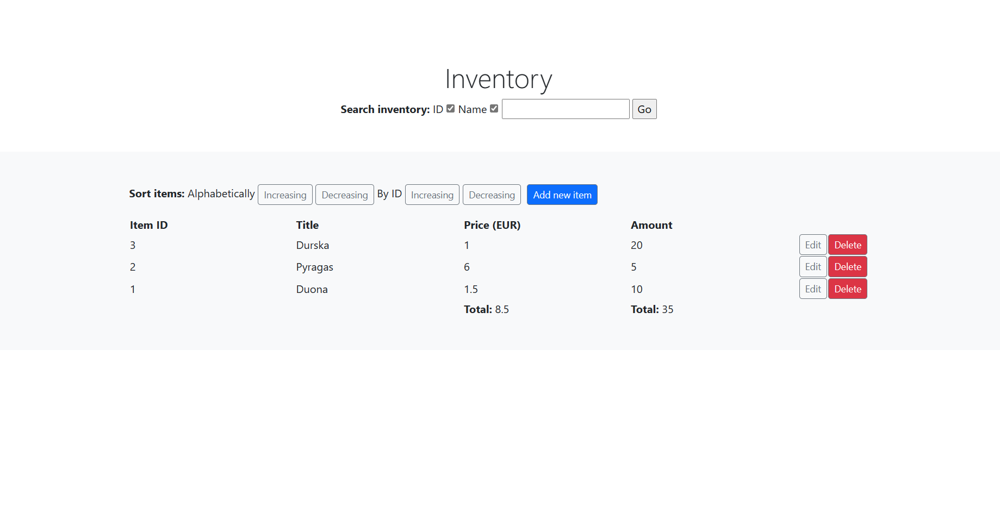
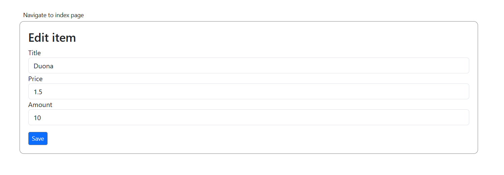

<h2>Description</h2>
A simple CRUD application for managing a shop inventory, made using Symfony framework and it's MVC pattern. Employed Symfony FormTypes for adding/editting elements, SQLite database, Doctrine ORM for communication with the database, Symfony Validator attributes for validation, Twig template engine for views, DataFixtures for data seeding, Bootstrap library for styling.
<h2>Functionality</h2>
<ul>
    <li>List of items added, with item's price and amount.</li>
    <li>Adding, updating and deleting items.</li>
    <li>Verification for item fields (field must not by empty, title longer than 3 characters, price higher than zero).</li>
    <li>Increasing and decreasing sort by item ID and title.</li>
    <li>Total price of all items and total amount of all items.</li>
    <li>Search items by title and/or item ID.</li>
</ul>

<h2>Launch Instructions</h2>
<ol>
    <li>NOTE: you need to have composer and <strong>PHP</strong>, <strong>Composer dependency manager</strong> and <strong>SQLite engine</strong> installed. If you do not have it, you can find instructions for installing PHP (for Windows 10) <a href="https://www.geeksforgeeks.org/how-to-install-php-in-windows-10/" target = "_blank">here</a> and instructions for Composer <a href="https://getcomposer.org/download/" target = "_blank">here</a>. It is recommended to install Composer globally using the installer, so that you could run it from any directory. You can download the SQLite engine <a href="https://sqlite.org/index.html">here</a>.</li>
    <li>Download and extract the zip file or pull the repository from the GitHub.</li>
    <li>Run your CLI tool as Administrator, set the current directory to the project's main directory and run 'composer install' to auto-install required dependencies.</li>
    <li>If you have <a href="https://sqlite.org/index.html">SQLite engine</a> installed, migrate the database schema by running 'php bin/console doctrine:migrations:migrate' on your cli. Type 'yes' and click enter when prompted.</li>
    <li>Load the data to the database by running 'php bin/console doctrine:fixtures:load' on your cli. Type 'yes' and click enter when prompted.</li>
    <li>After the installation is complete, run 'symfony server:start' to launch the development server. Alternatively, you can run 'php -S localhost:8000 -t public/' tolaunch the php custom development server.</li>
    <li>You should be able to access the project at http://127.0.0.1:8000/ or localhost:8000.</li>
</ol>

Made by Mykolas Baranauskas. <a href="https://mykolasbar.github.io/my-website/" target="_blank">Website</a>, <a href="https://www.linkedin.com/in/mykolas-baranauskas-b3809b110/" target="_blank">LinkedIn</a>.